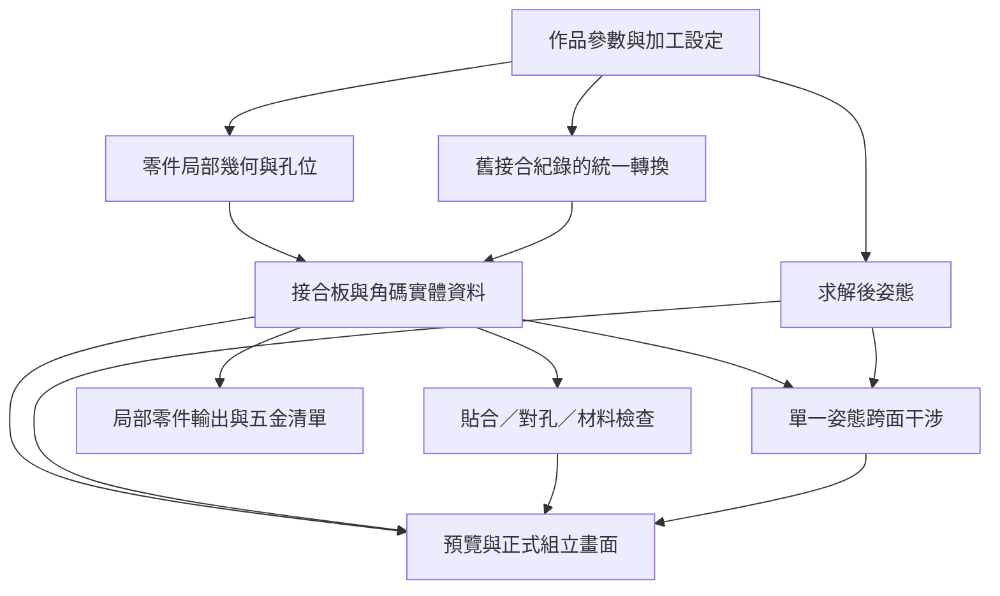

# SDD — 機構積木框架穩定化與 LOOP 施工

> 日期：2026-10-09（Asia/Taipei）  
> 文件版本：0.3／2026-10-09 使用者已確認開工；Astra 使用 low  
> 規劃基準：`1537242`，應用版本 `2026.10.08.13`  
> 已依使用者「好..請動工」啟動 W0–W6；實際進度與證據見 [工作紀錄](FRAMEWORK-WORKLOG-2026-10-09.md)。  
> 本 SDD 的「完工」指下列穩定化範圍完成，不代表所有機構、加工工法或實物承重均已驗證。

## 1. 目的與依據

把「使用者發現錯誤 → 局部修補 → 再出現不同步」改成「實例重現 → 明確條件 → 小包修正 → 完整驗證 → 集中發布」。使用者主要驗收操作感受；資料、幾何、對孔、保存與輸出一致性由施工方先驗證。

依據：

- [框架檢討](REVIEW-FRAMEWORK-2026-10-09.md)：問題候選與改善方向。
- [AGENTS.md](../AGENTS.md)：純 ES modules、Blocks 主線、凍結舊入口、最小改動等約束。
- [既有架構 SDD](SDD-BLOCKS-ARCHITECTURE.md)、[六面精靈](mobile-six-face-wizard.md)：保留適用規則，衝突處在 W0 記錄。
- 最近「板材直角貼齊、角碼貼板、孔位同軸」的實際回歸案例。

檢討文件中的「139 支／9 支失敗」「檔案行數」「408 處版本參數」是該文件的觀察，不當成這次已重測的結果。W0 必須產生附 commit、環境、指令的現況報告。

### 1.1 本次審閱處置

2026-10-09 使用者已確認 D1「多個接合位置，每次組立各選一面」與 D2「改寫教材，統一使用精靈」。這兩項產品決策已定案；尚未把選項回覆視為整份計畫的開工確認。

v0.3 依使用者節省 token 的要求，將 `gpt-6-astra` 推理強度改為 `low`；Astra 不自動提高推理強度，確有必要時另附理由請使用者確認。其餘模型分工與驗收要求維持不變。

| 審閱項目 | v0.2 處置 | 對應章節 |
| --- | --- | --- |
| 1. 中間機構、多個承接位置 | 採 D1；保留 `mates`，分清設計預設與每筆實際接合 | §2.4、§3.2、F3 |
| 2. 教材依賴工程模式 | 採 D2；補足範例固定點，驗收學生操作與學習目標 | §2.4、F4、W5b |
| 3. 兩套角碼計算 | 沿邊與六面最後共用實體資料；擴用獨立角碼驗算器 | §3.6、W4a／W4b |
| 4. 主流程跨面干涉 | 納入單一姿態檢查，明列覆蓋與未支援範圍 | §3.7 |
| 5. 工作量與施工順序 | 先完成 F1 全流程，再擴展其餘格式與作品 | §7 的 G1 門檻 |
| 6. 手機效能 | 加入實機量測程序、數值門檻與快取驗收 | §4.5 |
| 7. 協作分工 | 同時只有一個寫入者，其他助手只審閱 | §6、§8 |

## 2. 已定案需求與範圍

### 2.1 直接沿用的產品決策

| 決策 | 本計畫要求 |
| --- | --- |
| 設計端接合 | 一個設計可有多個接合位置；每次操作只選一個桿件／板件的一面，點選變色；不把整個設計限制成只能用一面 |
| 組立入口 | 單一、手機優先的精靈；不重新引入工程模式讓使用者選 |
| 操作順序 | 兩端各選一面 → 預覽與位置調整 → 固定件／孔位 → 確認保存；直角接合提供自動貼齊，同平面練習仍在同一精靈內完成 |
| 貼齊 | 指定板邊接觸指定板面，兩板成直角，無間隙、無穿入；不擅自改接另一個面 |
| 對孔 | 角碼兩翼同時貼板，角碼孔與各自板孔同軸；不能為湊孔而讓角碼離板 |
| 修改參數 | 保留參數化能力，尺寸變動後重算相依資料；無法保持原接合就指出原因 |
| 預覽 | 確認前是草稿，取消不得改動作品、復原紀錄或自動存檔 |
| 相容性 | 保留既有作品、教學範例、JSON、SVG／DXF、製作包的適用能力 |
| 狀態說明 | 「已定位」「已貼齊」「固定孔有效」「干涉已驗證」分開計算；未檢查不當成通過 |

### 2.2 本輪必做

1. 可重跑的測試清單、標準作品與發布檢查。
2. 重現並處理框架檢討列出的失敗；查明產品回歸或測試失效，不能只改斷言求綠燈。
3. 自動產生／驗證載入版本，讓正式頁面與精靈使用同一組模組。
4. 接合的統一內部讀取契約、多接合位置相容讀取，以及沿邊／六面共用的接合板、固定孔、角碼與五金實體資料。
5. 以相同幾何與姿態供給接合預覽、正式 3D、零件輸出及製作包；2D 需要顯示的接合特徵也取自同源資料。
6. 讓本次接合預覽使用候選狀態，確認為一筆復原，取消無副作用。
7. 六面接合的單一姿態跨面干涉檢查、手機效能驗收，以及教材的精靈操作驗收。
8. 手機與電腦實際操作驗收、版本紀錄、完成報告與正式發布。

### 2.3 明確不納入本輪

- 整套軟體重寫、更換前端框架、TypeScript 遷移、引入 bundler／npm 建置需求。
- 一次拆完 `app.js`、全面更換求解器、遷移所有操作的狀態管理。
- 新的存檔 schema 版本或強制把所有 `mount` 改寫成新的 `joint` 格式。
- 新增力學／扭力分析、CNC 公差校正、爆炸圖、兩端固定閉環構件。
- 凍結的 `mechanism.html` 新功能或獨立 bug 整理；共用模組若受本輪影響，仍須驗證相容性。
- 新增全行程跨面碰撞引擎。單一姿態檢查納入本輪；既有掃描能力保留，不能把逐姿態檢查或少數抽樣宣稱為連續全行程驗證。

上述項目只列入後續清單，不作為無止境擴充本輪的理由。

### 2.4 已確認的產品補充決策

**D1：多個接合位置，每次各選一面。**「接合位置」是對零件與面／邊的參照；「接合」才是把兩個位置連起來的紀錄。使用者仍在圖上點桿件、選面與看變色；不新增必填的角色表單。中間機構可用底部裝到底座，再用工具架接夾爪。同一工具架可接兩個夾爪，各自保存位置、面與偏移；是否放得下由幾何、孔位及干涉判斷，不以「位置已使用」一律禁止。

本輪維持既有單一父安裝關係：每個子模組最多裝到一個父模組，但可承接多個子模組。D1 不包含雙親安裝、循環接合或新的閉環求解。

**D2：改寫教材，統一使用精靈。** 不保留教材專用工程模式入口。`teaching-assembly.html` 的同平面練習改走同一精靈，補足製作所需的兩個不同固定接點及對應參照；不能把原來一點定位直接說成已能固定。保留「接到移動工具架、整組隨動、比較同平面與直角」的學習目標，不能只刪除練習或換成完全不同的直角任務。舊教材作品仍須能開啟；定位可用但固定條件不足的舊例要明確顯示狀態。

精靈依兩端幾何提供適用的對鎖或角碼固定方式；不要求學生理解 `mount` 格式。教學文字、範例、提示與實際按鈕在同一工作包更新。與本決策衝突的舊 SDD 標示被本文件取代的段落，保留歷史背景。

## 3. 架構設計

### 3.1 分開「設計幾何」「運動姿態」「接合關係」

底層計算為純函式，不直接讀 DOM、全域 `S` 或 localStorage。資料採 plain objects，不能把 class 實例塞進作品存檔。

### 3.2 統一接合讀取契約，先不改存檔

新增或收斂一個純函式轉換層，將既有同平面、`mount.orient`、`mount.face` 轉成共同的內部描述。`mates`、`faceParts` 是設計端參照／預設，不等於已完成接合；不能用目前選中的面覆寫各筆既有接合。

建議契約（名稱與檔案可在 W3 依現有程式調整，語意不得混用）：

| 資料 | 必要內容 |
| --- | --- |
| `ConnectionEndpoint` | 模組 ID、零件 ID、面／邊的穩定參照、來源 `mates`／output／零件參照、可用性與原因；不以世界座標作身分 |
| `ConnectionDescriptor` | ID、來源格式、host／child 模組與零件、面／邊參照、placement、fastener、支援能力、診斷 |
| `PartGeometry` | 零件 ID、局部輪廓、cutouts、板厚、孔與用途、來源零件／接合 ID |
| `PartPose` | 零件局部座標到組立世界座標的剛體矩陣，以及所用參考姿態 |
| `ConnectionGeometry` | 兩端接觸區、角碼實體與接觸面、孔軸、板孔與角碼孔的對應 ID、螺絲／隔圈等五金實例與規格、幾何版本 |
| `ValidationReport` | 檢查項目、`pass/fail/not_checked/not_supported`、原因代碼、相關零件／面／孔 ID、作品／幾何／姿態 revision 與檢查覆蓋範圍 |

禁止靜默猜測無法轉換的舊接合。保留來源紀錄並回傳可理解的原因；缺失接面不能自行替換成另一個零件。現有 JSON 讀寫與 round-trip 保留必要欄位；本輪衍生模型不寫入存檔。

2026-10-09 使用者已核准 W0 最小反例後的兩項相容補充，維持 `blocks v1`：`mount.face.childPart` 可選欄位保存 `frame` 或固定桿穩定 ID，不依賴角碼啟用；六面宿主底板沿用既有 `mount.to.frame: { edge }`，不另加格式。新建立／精靈確認明確保存 childPart。schema 只保留，不補猜舊資料；舊角碼已保存的 childPart 可唯讀相容解讀，無法確定時診斷 `legacy_child_endpoint_ambiguous` 並保留原紀錄／轉換，要求可見重新選面。沒有新增其他存檔欄位。

W3a 的 `connection-descriptor.js` 先接入 F1 六面來源，端點、placement、fastener 與能力分開，refresh／角碼／重選共用端點；其他來源明確 `connection_format_not_supported`。六面 `to.frame` 能保存與讀取，但幾何完整接入列 W3b（G1 後），暫回報 `host_frame_not_supported`，禁止改成輸出桿猜算。缺失端點仍保留格式合法的接合紀錄；宿主不存在時不承諾可求解世界姿態。歧義舊 child 的 3D 沿用既有顯示 anchor，明確標示未解析端點，不作有效固定或開孔依據。

多位置的相容規則：

- `mates.attach` 目前只有 `normalDeg`，它是安裝方向提示，不能憑方向猜成特定桿件的一面。`mates.receive[]` 保留既有 ID、名稱與有效參照，不淘汰、不壓成一筆 `faceParts`；依現行契約最多 8 筆命名承接位置，本輪不擴充此上限。
- 新式 `faceParts: { part, face }` 與舊式 `receive/attach/receiveFace/attachFace` 繼續可讀，作為預選與舊資料解讀依據。它們不是全模組所有接合必須共同使用的面。
- 接合位置清單由既有零件、outputs、`mates` 等推導；本輪不另造一套必須同步保存的命名位置資料庫。每筆已確認接合的 host、child 與面依該筆紀錄解析，後續修改預設不能讓已安裝構件改接面。
- W0 先用既有 `mount.to`、`ref/home`、`mount.face` 與零件參照證明 D1 可無損保存；特別檢查目前 `mount.face` 沒有獨立 child 零件 ID 的情況。W3a／W3b 再實作、驗證 round-trip。不得把「換了預選面仍能重開正確」留到發布才發現。
- 若既有欄位確實無法區分必要的端點，先交付最小反例與向後相容的欄位補充提案，依 §8 取得確認後才變更持久化契約。不能默默丟失端點，也不能為遵守「不改 schema」退回每設計只能選一面。
- 失效參照需顯示原因並要求重新選取；不因外形重算、排序變化就把原接合改到另一條邊。相容要求涵蓋現有合法資料；不把已被舊清理器捨棄的無效欄位宣稱為可復原。

舊作品可以沿用相容計算。本輪新建組立只使用既定精靈，無須讓使用者理解舊模型分類。

### 3.3 幾何只推導一份，姿態單獨更新

- 幾何使用明確的零件局部座標，長度單位 mm；旋轉以既有 API 契約轉換，不混用度與弧度。
- 設計參考姿態與求解後姿態分開；父子接合、巢狀接合、疊層高度不得各加一次相同轉換。
- 鑽孔位置來自共同幾何，顯示與加工輸出不得各自重新估算孔心。
- 角碼翼面有實際厚度；判斷貼合使用接觸表面，不能把角碼中面當成貼板面。
- 視角旋轉只改相機，不得改機構資料；板孔跟隨所屬桿件，不能跟隨畫面投影。
- 快取 key 包含影響形狀的零件參數、板厚／加工設定、接合設定與幾何版本；播放只更新姿態。改尺寸、取消、復原、開檔都要正確失效。
- 2D 示意圖可簡化視覺表現，但其零件參照、孔位與姿態來源須一致。

### 3.4 貼齊與對孔的共同條件

| 檢查 | 判準 |
| --- | --- |
| 直角 | 兩板法向垂直；「接合角度」數字不作為證明 |
| 板材接觸 | 指定板邊與另一板實際材料接觸；空的外框範圍、只有單一角點碰觸不算有效接合區 |
| 角碼貼合 | 兩翼各自接觸板面，實體厚度朝材料外側，不懸空、不穿入 |
| 孔軸對準 | 同一組配對 ID 的板孔與角碼孔方向一致、軸線重合；孔心可沿厚度方向相隔 |
| 材料可用 | 孔緣距、角碼覆蓋區、槽口與其他孔通過既有規格檢查 |
| 既有孔 | 只有在貼合與規格皆成立時才能沿用；不合法就回報衝突，不強移角碼、不擴孔掩蓋 |

數學驗收初值：單位法向點／叉積誤差 `1e-6`；幾何變換殘差 `1e-6 mm`；涉及既有三位小數輸出的孔位比對允許 `0.005 mm`。幾何容許值與實際加工公差分開，不用放寬公差掩蓋錯位。W0/W3 若現有測試提供更合理尺度，記錄依據後集中調整。

先貼齊板材，再找角碼的可行配置。角碼放不下時，保留板材貼齊結果並指出原因；不能宣稱固定完成。修改角碼位置會同步重算兩板孔位，並再次驗證。

### 3.5 預覽與確認邊界

本輪只整理接合相關的候選狀態：讀取作品 → 建立候選接合 → 驗證 → 預覽。計算不得「暫時替換 `S` 再換回」。確認前檢查來源作品 revision，過期草稿需重新計算；確認只提交一次，產生一筆復原與一次存檔排程。取消、關閉、輸入無效都不更動原作品。

不為此重構所有無關操作。只抽出接合流程需要的協調模組，`app.js`／`bench-ui.js` 保留其餘行為。

### 3.6 兩種角碼接法共用一份實體資料

目前沿邊直角接合的 `orthogonal-joint.js` 與六面接合的 `face-bracket-*` 分別推導角碼與孔位。W4 的終點必須是：兩者只保留來源解讀、適用接法與候選配置的差異，均把選定配置交給同一份角碼規格與實體建構函式。沿邊接合若使用列印轉接件，保留其專屬幾何；不假裝它是相同金屬角碼。

共同結果包含每顆角碼的穩定 ID、兩翼外形／厚度／接觸面、局部到世界姿態、每孔的軸線與板孔配對、螺絲長度與五金料號。2D、3D、加工孔、SVG／DXF 與製作包只做表示轉換，不得再各算一次尺寸與孔心。配置演算法可以不同，但相同規格與配置不得產生不同實體。W4a 先讓 F1 使用；W4b 移除沿邊消費路徑中的重複推導，只留下委派給共同核心的相容入口。

以現有 `test/_bracket-audit.mjs` 的獨立驗算條件驗收：長短腳貼板且相接、實體不穿板、兩翼孔軸各自對準板孔、螺絲頭在材料外側、長度足夠且與五金表相同。現有 helper 依賴 `_bench-setup.mjs` 全域與固定兩顆角碼假設，不能直接當通用 runner；在測試側把輸入、角碼數與規格參數化，覆蓋兩顆／三顆、正反面及巢狀姿態。期望值仍由板面、量測到的實體與規格獨立驗算，不能改成呼叫生產程式的「驗證成功」結果。

另設缺孔、錯軸、角碼離板、螺絲規格不一致的負例，證明驗算器會攔截。角碼幾何、板孔或五金資訊缺一項，不能顯示「固定完成」或輸出看似完整的製作包。

### 3.7 預設流程的單一姿態跨面干涉

W4 納入六面接合在**目前一個有效求解姿態**的跨模組干涉。使用共同實體與 `PartPose`，檢查實際材料，包含本輪標準作品中的板件、桿件、具輪廓的齒輪、角碼與已建模五金；不是只檢查兩個外框。既有同平面／沿邊檢查不能因整合而退步。

- 第一階段用包圍盒篩出候選對；第二階段依實際輪廓擠出、板厚、孔／槽／開口判斷接觸或穿入。包圍盒重疊不直接算碰撞，也不代表已完成精確檢查。
- 合法板邊貼面、角碼貼板、螺絲穿過配對孔，需依具名配對與幾何條件辨識。不能整組略過相鄰模組，否則同一夾爪其他部位撞板會被漏掉。齒輪嚙合等既有允許接觸規則也須保留其明確條件。
- 結果至少提供碰撞雙方 ID、可高亮的位置及原因。單一姿態通過只顯示「此姿態：已檢查範圍無干涉」；缺少實體或演算法不支援的配對逐項列出，整體狀態標為部分未驗證，不能亮全域綠燈。
- 驗收包含：直角剛好貼齊、間隙、超出容許值的微小穿入、旋轉後碰撞、巢狀變換、穿孔合法與撞孔壁不合法。F1 的板件與角碼必須完成實際檢查，不能以 `not_supported` 代替本輪必做項目。
- 預覽停穩、參數變動後與確認接合前檢查；播放時不強制每幀做精確碰撞。結果攜帶姿態 revision，姿態一變就標示「目前姿態待檢查」或明示上次已檢角度；暫停後重驗。非同步舊結果不得覆寫新姿態狀態。

這是數位幾何的單一姿態驗收，不擴張為連續碰撞、實物承重或未建模零件的安全保證。

## 4. 標準作品、測試與發布

### 4.1 固定驗收組

| ID | 作品／組態 | 主要涵蓋 |
| --- | --- | --- |
| F1 | 四連桿升降臂＋夾爪；含設計水平但求解後偏轉的案例 | 本次錯位重現、正反向直角、不同板厚、運動後貼板與孔軸 |
| F2 | 齒條升降＋夾爪 | 齒條限位、支援／不支援狀態、板厚、接合參照 |
| F3 | 底座 ← 升降臂 ← 夾爪；另設同工具架兩夾爪與已安裝底板再接模組的變體 | 中間機構不同端點、改預選不改既有接合、共用承接面、巢狀矩陣、圓角矩形有效邊、孔位衝突 |
| F4 | 原教材同平面作品、舊直角紀錄，以及改版後的精靈教材練習 | 舊存檔相容；學生依文字完成選面、固定、播放、拆接；對鎖孔與五金輸出、原學習目標 |

原始使用者作品只在本機驗證，不直接提交下載目錄、使用者路徑、截圖或完整附件。由必要幾何建立可公開的最小回歸 fixture；正式測試不得依賴 `C:\Users\...`。可選本機檔案的診斷入口另行保留。

基準檔比較穩定 ID、零件數、局部輪廓／孔位／孔用途、五金數與接合矩陣；忽略時間戳及無意義順序。不能只比孔數或截圖。已知錯誤的基準需附「錯誤 → 正確」依據，禁止執行測試時自動接受新基準。

F1 是第一個必須貫通的作品；F2–F4 的既有回歸先維持可用，完整接入新共用核心在 F1 通過 §7 的 G1 後進行。F3 的多位置檢查包含存檔重開、移動承接桿與刪除其中一筆接合，確認不會移動、換面或刪掉另一筆接合與仍被使用的孔。

### 4.2 測試分層

1. 單一修正：先建立能抓出原錯誤的回歸，再做最小修改；檢查失敗是目標錯誤而非環境故障。
2. 接合整合：獨立計算期望值，不能測試與實作共用同一條錯誤轉換後互相比較就宣稱正確。
3. 變更鏈：改板厚／孔距／外形 → 接合重算 → 復原 → 存檔重開 → 輸出一致。
4. 運動：至少基準、兩個非零有效姿態；再依作品有效驅動範圍掃描。不得把無解區間算成通過或以三個姿態宣稱全行程驗證。
5. 整包完成：全部登錄的測試與 schema 測試重跑，結果附日期、Node 版本與 commit。
6. 瀏覽器：手機 `390×844`、電腦 `1280×800`，走目前精靈完成載入、選面、貼齊、角碼、確認、修改、取消、復原、重開；至少覆蓋一個失敗分支。
7. 教材：在預設精靈依 F4 文字從未安裝作品開始，完成同平面練習，再完成直角延伸；不能靠 console、內部函式或工程模式完成。文字提到的接點、按鈕與回饋必須真實可用。
8. 多位置：F3 每筆接合分別改面／移動／取消／確認／拆下，驗證其他接合及復原紀錄不受誤改；保存重開保留各自端點。

圓角矩形可接邊以可安裝的連續直線材料區判斷；不能單純用所有輪廓小線段當接口。尺寸太小要合理拒絕，不能只為讓舊測試過關而合併不共線的邊。

### 4.3 CI 與部署規則

- 建立零 npm 相依的 Node 測試 runner，明確列出可執行 suite、fixture/helper 排除規則、逾時、stdout/stderr 與 exit code；不能把 `test/*.mjs` 全部當執行入口。
- 先確認並固定一個可用 Node 版本；`--no-experimental-webstorage` 依該版本是否支援使用，不盲目混用版本。
- push／PR 執行測試；失敗必須使 workflow 失敗，不以 `continue-on-error` 當通過。
- 現有 Pages workflow 的 build／deploy 必須依賴同一 commit 的 test job，`workflow_dispatch` 也不能繞過測試；避免獨立 workflow 綠燈但部署仍先跑。
- 本輪目標是所有有效的 Blocks 與共用回歸測試通過。退出的測試只限確認過時、重複或屬凍結舊入口且與 Blocks 無依賴者，須記理由及替代覆蓋。任何有效功能失敗不得用排除取代修正。
- 瀏覽器驗收必做。若現有工具不足以在 CI 自動化，保留可重現的操作清單與本地證據，明確區分「CI 自動通過」與「瀏覽器已驗收」，不虛報無人值守 E2E。

### 4.4 版本與快取

採用可檢查的單一發布來源及產生腳本，保留靜態部署。腳本集中生成 Blocks、精靈、相關驗收頁的載入映射，涵蓋既有帶 query 的 import 別名與 queryless 路徑，避免同一模組被不同 URL 載入成多份狀態。

可用單一 release token 或相依內容 hash；W2 以能處理巢狀 imports、循環相依與舊別名的最小方案定案。產物可提交，CI 用 check 模式驗證過期，不在部署時私自改版本。舊凍結入口無關的參數不順便整理。

### 4.5 手機播放與快取效能驗收

W0 登記一台可取得的中階實體手機作參考裝置：型號、SoC、RAM、OS、瀏覽器版本、螢幕更新率、viewport、DPR 與渲染設定。固定使用 F1 和標準 F3，記錄各自零件／孔／五金數及有效驅動區間；基準與完成版在相同裝置及設定量測，不能靠刪零件、降精度或縮小場景通過。桌面模擬手機尺寸只驗 UI，不代替實機效能。

量測程序：前景執行、資源載入完成、關閉錄影及其他重負載；暖機 10 秒後播放 60 秒，每個作品做 3 次。記錄每次 p50／p95／最大值與採樣數，保留明顯熱降頻或被中斷的量測說明，不只挑最好的一次。

| 項目 | 本輪驗收門檻 |
| --- | --- |
| 每幀運算 | 每次量測的 p95「求解＋姿態更新＋2D 繪圖／3D 提交」CPU 耗時 ≤ `33.3 ms`；分項與合計都記錄 |
| 動畫排程 | 每次量測的 `requestAnimationFrame` 間隔 p95 ≤ `50 ms`；另列 > `100 ms` 次數，查明由本次程式造成的長停頓 |
| 同裝置回歸 | 若原版已達上述門檻，完成版 p95 合計耗時增加不得超過 `max(原值 × 10%, 1 ms)`；原版未達標仍須達絕對門檻 |
| 快取 | 單純播放、相機操作不得重建不變的局部板形／孔位／五金；設計參數或接合改動要重建受影響資料，取消／復原／重開不得沿用過期結果 |
| 精確干涉 | 不進入每幀必要路徑；在 §3.7 指定時機檢查，姿態改變不得保留過期通過標示 |

CPU 計時不包含 GPU 真正完成時間；rAF 間隔也不等於已量到每個實際呈現畫格，報告不得將兩者混寫成 GPU／FPS 保證。計時點與採樣程式保持最小，避免量測工具本身改變播放負載。

數字是本計畫的驗收門檻，尚非現有量測結果。W0 若無可用實體手機，先完成可重跑的量測入口與桌面基準，記錄缺口並安排必要的實機驗收；可獨立施工繼續，但 W6 不得標記手機效能已通過。若需更換參考裝置或調整門檻，附同條件證據取得使用者確認，不能施工後自行放寬。

## 5. LOOP 工作方式

LOOP 是本專案的執行程序，不是背景排程。使用者確認本 SDD 後，在可執行工作期間持續完成 W0–W6；不每一包重新詢問是否繼續。

| 步驟 | 動作 | 必留的簡短證據 |
| --- | --- | --- |
| L — Locate | 選一個工作項；讀相關契約、實例與上一輪結果 | 問題 ID、範圍、可重現步驟 |
| O — Observe | 保存基準，建立失敗斷言，提出有證據的原因 | 修正前結果、假設與驗收條件 |
| O — Operate | 最小變更；一次處理一個原因，不混入其他重構 | 修改檔案與行為差異 |
| P — Prove | 執行目標測試、整合檢查；需要時做 UI 驗收 | 實際結果、差異、風險、下一項 |

**通過**：記錄並提交該工作包，進下一項。**失敗**：留在同一 LOOP 修原因，不能先 bump 版本當成完成。

同一假設修兩次仍未改善，就停止原路徑、收斂重現並改用獨立診斷；最多一次 Astra／low 根因審查後重新拆包，不自動提高 Astra 推理強度。這是改變方法，不是自動放棄或反覆問使用者。只有依第 8 節需要外部決策時才提問。

每個工作項記錄：`ID／狀態／唯一寫入者／分支／起點 commit／驗收條件／模型與理由／結果／產物位置／下一步`。狀態用 `planned → reproducing → implementing → verifying → done`，另記具體 blocker。交棒另記最後 commit、未提交檔案、待完成檢查與接手者；上下文中斷後先讀此記錄，只補必要背景，不從頭探索。

## 6. 模型選擇與 token 控制

原則是選能通過該包驗收的較輕設定，而非每項都用最強模型。官方模型選擇原則支持按任務難度、品質要求與成本取捨；下表的工作分配、重試門檻為本專案規則，並非官方效能保證。[OpenAI 模型選擇](https://developers.openai.com/api/docs/guides/model-selection)

以下名稱以本次工作環境所列可用模型為準，施工時仍檢查能力。不同模型／訂閱的消耗不能只用價格或 token 數互相代換；不承諾未量測的節省百分比。

| 工作 | 預設模型／推理 | 升級條件 |
| --- | --- | --- |
| 已知格式的清單、文件同步、失敗摘要 | `gpt-6-luna`／low | 需要跨模組理解時交 Sol，不自行猜契約 |
| 測試 runner、版本腳本、界限清楚的小修正 | `gpt-6.1-sol`／medium | 出現相容性或跨模組失敗時升 high |
| 接合轉換、局部／世界座標、資料相依、幾何實作 | `gpt-6.1-sol`／high | 最小案例仍無法定位、兩次無進展才交 Astra／low |
| 困難根因、契約衝突、關鍵幾何審查 | `gpt-6-astra`／low | 維持 low，不自動升至 medium／high／xhigh 等更高強度；先縮小案例與拆包，仍有必要才附理由請使用者確認 |
| 指令、測試、基準檔比對 | 確定性腳本 | 不叫模型逐行閱讀所有通過輸出 |

執行方式：主代理保管決策、整合及驗收；確認本 SDD 後，可依上表委派單一有邊界的施工或審查子任務。**任何時刻只有一個寫入者，分檔、分支不同也不例外。** 若子代理接手施工，主代理在交棒期間只讀取、審閱及回報，不能同步編輯程式、測試或施工文件；待子代理交回並核對差異才恢復寫入。其他助手只做不改工作區的審閱，不自行修正、格式化、更新基準或提交。

最多同時一個施工子任務與一個唯讀審閱子任務；小修改直接由主代理完成，避免分工開銷大於收益。選模型是按工作包輪流接手，不是多模型各做一份競爭實作。若環境不能隔離審閱工具的寫入副作用，審閱也改為序行。不另開使用者聊天、不自行建立排程。

主聊天的模型不假稱能自行切換；可選模型透過有此能力的子任務介面指定。若不可用，記錄實際模型，以已授權的可用設定完成，不以不可用為由自行提高 Astra 推理強度；費用／使用量限制妨礙必要工作時才詢問。

節省 token 的具體要求：

1. 探索先 `rg` 找目標，再讀必要段落；已讀且未變的契約不反覆讀。
2. 子任務只帶「任務卡＋檔案路徑＋相關契約＋失敗輸出＋驗收」，不複製整段聊天史；不得為同一小問題開多個平行解法。
3. 一般任務卡目標一頁內；工具輸出先保留失敗摘要，完整 log 留檔，必要時再讀。
4. 同一包先做定向測試，通過後才整合測試；沒有新變更不重複跑相同全套。但省 token 不得省略發布前完整驗收。
5. 重用目前任務的 checkpoint；文件更新集中在工作包完成，不每次編輯都重寫整份 SDD。
6. 高階模型只收到精簡差異、重現與待決問題。幾何／相容性重要包做一次獨立審查，低風險文字變動不強制雙重審查。
7. 記錄可取得的模型用量；不可取得時記模型、呼叫次數、重試數與耗時，不能虛報精確 token。未指定總 token 預算，本計畫不擅自加硬性額度。

## 7. 施工工作包與完成門檻

| 包 | 交付內容 | 通過條件 | 主要模型 |
| --- | --- | --- | --- |
| W0 基準 | 現況測試清單／失敗分類、F1–F4 規格、D1 儲存可行性、教材缺口、手機效能基準、單一寫入者紀錄 | 真實重跑；每個失敗有重現與歸屬；確認 D1 端點可保留或提交必要契約例外；不更改產品行為 | Sol medium；摘要可用 Luna |
| W1 安全網 | runner、回歸修正、fixture、CI＋部署依賴 | 有效 suite 與 schema 全過；測試失敗確實阻擋部署；原先錯誤能被回歸測試抓到 | Sol medium/high |
| W2 載入一致 | 版本／importmap 生成與 check、相關文件 | 冷載入、一般重新整理、精靈 iframe 使用相同發布；不混載同模組版本 | Sol medium |
| W3a F1 契約 | 先做 F1 六面接合的共同讀取描述、座標與保存測試 | 讀取不改原資料；F1 兩端選面可準確 round-trip；介面預留其他來源但不先重構全部 | Sol high |
| W4a F1 實體 | F1 共用板件／角碼／孔／五金／姿態、獨立 audit、單一姿態干涉與快取 | F1 貼齊、孔軸、材料及五金規格通過；負例能被拒絕；有效運動姿態不錯位 | Sol high；唯讀幾何審查 |
| W5a F1 全流程 | F1 接上預覽、正式 2D／3D、SVG／DXF、製作包與接合草稿 | **G1 通過後才擴展其他格式**；不是只完成幾何 API 或一張預覽圖 | Sol medium/high |
| W3b 其餘契約 | 同平面、`mount.orient` 來源轉換；D1 多接合位置的完整相容性 | 三種來源皆讀取不改原資料；多位置 round-trip；缺失參照明確診斷 | Sol high；必要時 Astra low |
| W4b 共用完成 | 沿邊角碼消費端改用同一實體核心；F2–F4 相依幾何、孔位、五金與干涉 | 兩套角碼不再各自推導實體；擴充 audit；F3 串接／雙夾爪、尺寸變動與相容驗收 | Sol high；唯讀差異審查 |
| W5b 全流程與教材 | 其餘消費端接入；手機操作；F4 精靈教材、範例與衝突文件同步 | 全部適用流程可走完；原教材可讀、新教材可操作；§4.5 效能通過或明列待實機驗收 | Sol medium/high |
| W6 發布 | 完整測試、UI 證據、版本紀錄、提交／推送、部署核對與交付報告 | 第 9 節全部成立，發布 commit 與測試 commit 相同 | 主代理整合 |

依賴：`W0 → W1 → W2 → W3a → W4a → W5a → G1 → W3b → W4b → W5b → W6`。W3–W5 的 a／b 是原工作包的兩個階段，不是新增一套平行工程。基準與既有回歸可以涵蓋全部格式；新核心先貫通 F1，再擴展。每包可拆多個 LOOP；必要橋接保留舊呼叫介面，不一次替換所有消費端。G1 是內部驗收門檻，通過後自行續做，無須再問使用者是否繼續。

**G1：F1 第一條完整流程的通過條件**

1. 從未接合的升降臂＋夾爪開始，精靈選面、90° 貼齊、角碼與配對孔可見，單一姿態干涉有真實結果與覆蓋說明。
2. 預覽取消零副作用、確認一筆復原；正式畫面、存檔重開、改尺寸及非零有效姿態維持同一接合。
3. 實際產生 SVG、DXF、製作包，核對局部孔位、輪廓及五金規格；3D 中每顆角碼與螺絲都能追到同一輸出記錄，獨立 audit 通過。
4. 手機尺寸與桌面操作可完成，目標及既有回歸通過；取得 F1 效能量測與快取檢查結果。若實機尚不可取得，明列缺口並繼續不相依工作，W6 仍受 §4.5 限制。

每個階段只保留具名且有下一步期限的相容橋接；W6 前不能以「F1 通了」代替 F2–F4，亦不能長期保留兩套仍各自計算角碼的核心。

通過本 SDD 不等於修改任意模組的授權。若某工作必須擴及未列入的求解器演算法、存檔格式或全域狀態重構，先說明新增範圍與副作用，再依第 8 節處理。

## 8. 自主施工、提問與恢復

### 確認後自行進行

- 範圍內的診斷、修正、測試補強、介面一致性、相容轉換、測試假 DOM 修復與文件同步。
- 依 §6 已授權範圍選模型、局部拆包、在既定契約內的命名與檔案安排；Astra 固定使用 low。
- 每包本地提交；依既有授權於整合驗收後 commit／push／發布，不重複詢問是否繼續。

### 必須詢問的例外

- 兩種產品語意都合理、現有需求無法決定，且選擇會改變使用者作品行為。
- 需要改存檔格式、丟棄或無法還原既有資料；或者要移除仍有效的使用者功能／測試要求。
- 需要額外付費服務、硬體量測、憑證／權限，或缺少必要的原始作品而無法重現。
- Astra／low 在縮小案例與拆包後仍不足，確需提高其推理強度；先附問題、既有嘗試與必要理由，未確認前維持 low。
- 擴出第 2 節範圍、需要重大跨模組改動且本 SDD 未涵蓋。

提問時附重現、已完成的可審閱結果、兩個以內主要選項與建議，不以空泛「要不要繼續」中斷。可獨立的工作仍繼續。

施工保護：先確認 git 狀態，保留使用者未提交內容；使用 `codex/framework-stabilization` 開發分支或合適的既有隔離工作區。每包驗證後提交；正式 main 在 W6 才更新。失敗修正只回復該包自有改動，不做整個工作區 reset／clean，不 force push。

協作保護：開工、交棒與恢復前核對工作記錄的唯一寫入者、分支及實際 git 差異。本次提出審閱的另一助手已表示施工期間不改程式；其角色記為唯讀審閱。若出現其他來源的新變更，先保存並比對，不覆蓋；只有衝突涉及未定產品語意時才請使用者決定。非衝突差異亦不可未審閱就混入本包提交。

若工具、執行上限或使用者中斷造成停工，保存最後完成項、未提交變更、失敗原因與下一個確切命令。恢復時接續，不假稱背景仍在施工。若外部部署受阻，報告「程式驗收完成、部署未完成」，不得宣稱全案完工。

## 9. 完工定義與交付

- [ ] 本 SDD 已經使用者確認開工；D1／D2 決策保留，W0–W6 與 G1 均有實際完成證據。
- [ ] 框架檢討列出的候選失敗全部完成分類與處置；本輪支援範圍無未解回歸。
- [ ] F1–F4 與使用者原始作品的適用項目驗收；原附件不納入公開 repo。
- [ ] 板材貼齊、角碼貼板、孔軸同軸、材料邊界、變更重算與舊存檔相容均有獨立驗證。
- [ ] 沿邊與六面角碼共用同一實體核心，獨立 bracket audit 含負例通過；3D 螺絲與五金表規格一致。
- [ ] 多接合位置的串接／雙夾爪操作與保存通過；改預選不影響既有接合，`mates` 合法資料未被單一選面覆蓋。
- [ ] 六面主流程的單一姿態干涉已驗收，檢查範圍及不支援配對明確；播放後沒有過期通過標示。
- [ ] 預覽、正式組立、孔位輸出與製作包在共同資料上保持一致。
- [ ] 手機／桌面完成操作驗收，沒有本次新增 console error、遮擋或無法完成流程。
- [ ] F4 教材使用精靈可從頭完成，同平面練習及直角延伸保留學習目標；不依賴工程模式入口。
- [ ] 參考手機完成 §4.5 效能驗收，附裝置、場景、採樣與快取證據；模擬手機視窗不計為實機通過。
- [ ] 必要 Node／schema／整合測試全部通過，CI 會阻擋失敗部署，版本映射可自動檢查。
- [ ] 版本紀錄與教學相關說明一致；commit、push、Pages 實際部署結果已核對。
- [ ] 完成報告列出修改、測試環境與結果、基準差異、截圖、已知能力界限與恢復方法。
- [ ] 工作記錄可追溯唯一寫入者、模型、分支與每次交棒；未混入使用者或其他助手尚未審閱的變更。

批准後才建立工作記錄，例如 `docs/FRAMEWORK-WORKLOG-2026-10-09.md`，保存每包摘要與決策；長測試 log／截圖留在 `output/framework-stabilization/`，不預設全部提交。交付以可操作版本與測試證據為準，不以改了幾個檔案或模型回覆「完成」為準。

## 10. 本次確認事項

2026-10-09 使用者以「好..請動工」確認本 v0.3 SDD。多接合位置、教材方向與 Astra／low 不再重問；依 §8 自主持續施工至 §9 完成，必要例外才詢問。實際進度以工作紀錄為準，不以本文件的完成清單推定已驗收。
